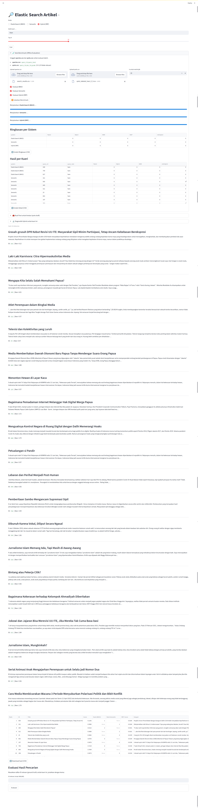

# 🔎 Elasticsearch + Streamlit (Hybrid Search) — README

Mesin pencarian sederhana berbasis **Elasticsearch** dengan UI **Streamlit**, mendukung **lexical (BM25)**, **semantic (kNN)**, dan **Hybrid (RRF)**. Data sumber:

* **Embeddings (JSONL):** `id, text, embedding`
* **Konten asli (JSON/JSONL):** `id, title, content`

Dirancang untuk berjalan via **Docker Compose**; indexing + UI dilakukan dari container **streamlit-app**.

---

## Fitur

* Pencarian **BM25** (lexical).
* Pencarian **kNN** (dense vector; cosine).
* **Hybrid RRF** (gabungan rank lexical + semantic).
* Tabel hasil dengan **ranking** dan **skor BM25 dinormalisasi 0–1**.
* **Download CSV** hasil.
* Inisialisasi index + **bulk indexing** dari 2 sumber data (corpus + embeddings).
* Siap untuk **Compose Build Bake** (`COMPOSE_BAKE=true`) bila diinginkan.

---

## Arsitektur

```
┌──────────────────┐        HTTP/JSON        ┌────────────────────────────┐
│   Streamlit UI   │  <--------------------> │ Elasticsearch (single node)│
│  (streamlit-app) │   Search, kNN, RRF      │   BM25 + Dense Vector kNN   │
└──────────────────┘                          └────────────────────────────┘
         ▲
         │  (init index + bulk index)
         │
     /data/{corpus.json|jsonl, embeddings.jsonl}
```

---

## Prasyarat

* Docker & Docker Compose
* RAM 2–4 GB (dev)
* Port bebas: `9200`, `8501`

> **Catatan model embedding:** set `MODEL_NAME` & `VECTOR_DIMS` agar **sesuai** dengan model yang Anda pakai saat membuat `embeddings.jsonl` (contoh: `all-MiniLM-L6-v2` → 384 dim).

---

## Struktur Proyek

```
search-app/
├─ docker-compose.yml
├─ streamlit-app/
│  ├─ Dockerfile
│  ├─ requirements.txt
│  ├─ settings.py
│  ├─ app.py
│  ├─ init_es.py
│  └─ index_jsons.py
└─ data/
   ├─ corpus.json        # atau corpus.jsonl
   └─ embeddings.jsonl
```

> Jika Anda menggunakan struktur lain, **sesuaikan `build.context`** pada `docker-compose.yml`.

---

## Format Data

### 1) `embeddings.jsonl`

Setiap baris adalah JSON:

```json
{"id":"doc-001","text":"Ringkasan isi dokumen ...","embedding":[0.012,-0.034,...]}
```

* `embedding` harus float array dengan panjang = `VECTOR_DIMS`.

### 2) `corpus.json` (array) **atau** `corpus.jsonl` (per baris)

```json
[
  {"id":"doc-001","title":"Judul A","content":"Isi konten dokumen A ..."},
  {"id":"doc-002","title":"Judul B","content":"Isi konten dokumen B ..."}
]
```

atau

```json
{"id":"doc-001","title":"Judul A","content":"Isi konten dokumen A ..."}
```

---

## Konfigurasi Lingkungan

Diset di `docker-compose.yml` → service `streamlit-app`:

* `MODEL_NAME` (contoh: `sentence-transformers/all-MiniLM-L6-v2`)
* `VECTOR_DIMS` (contoh: `384`)
* `ES_HOST` (default: `http://elasticsearch:9200`)
* `ES_INDEX` (default: `docs`)

---

## Menjalankan

1. **Build & up**

```bash
cd search-app
# (opsional) aktifkan bake untuk build lebih cepat
export COMPOSE_BAKE=true

docker compose up -d --build
```

2. **Cek Elasticsearch**

```bash
curl http://localhost:9200
```

3. **Inisialisasi index**

```bash
docker compose exec streamlit-app python init_es.py
```

4. **Indexing data**

```bash
# Sesuaikan nama file Anda (json/jsonl)
docker compose exec streamlit-app python index_jsons.py /data/corpus.json /data/embeddings.jsonl
```

5. **Buka UI**

* Streamlit: [http://localhost:8501](http://localhost:8501)

---

## Menggunakan Aplikasi

* Pilih **Mode**:

  * **Lexical (BM25):** pencarian berbasis teks; skor ditampilkan sebagai **BM25 0–1** (min–max) relatif pada Top-K yang ditampilkan.
  * **Semantic (kNN):** pencarian vektor; skor dari ES (cosine-based).
  * **Hybrid (RRF):** gabung dua daftar hasil dengan **Reciprocal Rank Fusion**.

* Masukkan kueri → **Cari**.

* Hasil tampil dalam tabel; untuk Hybrid, kolom tambahan:

  * `Rank (BM25)`, `Rank (kNN)`, `BM25 (0–1)`, `RRF~Score`.

* Klik **⬇️ Download hasil (CSV)** untuk mengekspor tabel.

> **RRF ringkas:**
> `score = Σ 1/(k + rank_i)`, biasanya `k=60`. Menggabungkan *rank order* dari dua (atau lebih) daftar.

---

## Normalisasi BM25 → \[0,1]

* Dilakukan **per batch** hasil yang ditampilkan untuk transparansi (mis. Top-20).
* Jika semua skor sama, sistem mengembalikan **1.0** agar tidak terjadi pembagian nol.

---

## Perintah Umum

* **Hentikan & hapus container (tanpa volume)**

  ```bash
  docker compose down
  ```
* **Rebuild paksa**

  ```bash
  docker compose build --no-cache
  ```
* **Logs Streamlit**

  ```bash
  docker compose logs -f streamlit-app
  ```
* **Masuk shell container**

  ```bash
  docker compose exec streamlit-app bash
  ```

---

## Troubleshooting

* **`unable to prepare context: path ".../streamlit-app" not found`**
  Pastikan folder `streamlit-app/` **ada** dan jalur `build.context` pada `docker-compose.yml` benar.
  Opsi alternatif: ubah `build: { context: ., dockerfile: Dockerfile }` bila Dockerfile Anda di root.

* **`ConnectionError` ke Elasticsearch**
  Tunggu healthcheck hijau, lalu tes `curl http://localhost:9200`.

* **Dimensi embedding mismatch**
  Pastikan `len(embedding) == VECTOR_DIMS` dan `MODEL_NAME` cocok.

* **Hybrid hasil kurang relevan**
  Naikkan `Top-K`, atau tingkatkan `num_candidates` pada fungsi kNN di `app.py`.

* **Index ulang bersih**
  Jalankan `init_es.py` lagi (script ini akan drop + create index).

---

## Kustomisasi

* Tambahkan filter `tags`, `date`, `url` pada mapping (sudah disiapkan di `init_es.py`), lalu perluas UI.
* Ubah **k** pada `RRF` di `app.py` (`K=60` → tweak sesuai kebutuhan).
* Gunakan analyzer bahasa spesifik di ES untuk produksi (Indonesian stemmer/stopwords via plugin).

---

## 👥 Team

**Information Retrieval System Development Team**

- **Muhammad Ashabul Kahfi**  
  NIM: 24/537433/PPA/06796

- **Furqan, S.T**  
  NIM: 24/546979/PPA/06867

- **Kadek Gunamulya Sudarma Yasa**  
  NIM: 24/547500/PPA/06892  

- **Abdul Razak Aliudin**  
  NIM: 24/547523/PPA/06898

---

## Lisensi

MIT.

---

## Kredit

* [Elasticsearch 8.x](https://www.elastic.co/)
* [Streamlit](https://streamlit.io/)
* [Sentence-Transformers](https://www.sbert.net/)

---

## Catatan Pengembangan

* Proyek ini dioptimalkan untuk **pengembangan lokal** (single-node ES, tanpa security).
  Untuk produksi: aktifkan security ES, atur shard/replica, dan siapkan pipeline ingest sesuai skala data Anda.


## Aplikasi Awal 
